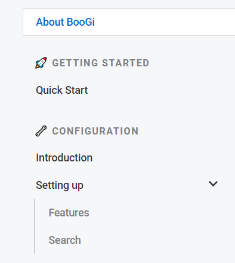

Understanding navigation is key to setting up you content properly,
especially sidebar and content links.

First, lets understand how page links are built from content structure.

# Page links

* root `content` directory represents a root of your app
* `index.md` (or `index.mdx`) **must** exist in `content` directory
   and it will be entrypoint (`/`) of your app.
* every link is derived from file name, e.g. file `myPage` in `content` directory
  creates link `/myPage`, so just extension is stripped
* link to the page is also derived from the relative path from `content`, thus
  each directory in `content` is a part of page path, e.g. file `myPage` in
  `content/mygroup` directory will have link `/mygroup/myPage`
* directories can be organized in groups (making a sidebar group) or
  subgroups (groups which are expandable and have nested pages).
* to create a subgroup with nested pages, you need to
  * create directory with nested pages, e.g. `nested_group`
  * in same directory as just created dir, create file `nested_group.md`
    which will be a "parent" of the nested group
* to create group, you need to:
  * 

Let's follow this example of project file and directory structure:

```
project
│
└───content
    │── index.md
    │── page1.md
    |── page2.md
    │
    └───group1
    │   │── my_page1.md
    │   │── myPage2.md
    │   └───myPage2
    │       │── my_subpage.md
    │
    └───page2
        │── my_page1.md
        │── myPage2.md
        └───myPage2
```

Structure defined as above, will generate following page paths (links).

```
index.md                      => /
page1.md                      => /page1
page2.md                      => /page2
page2/subpage.md              => /page2/subpage
group1/my_page1.md            => /group1/my_page1
group1/myPage2.md             => /group1/myPage2
group1/myPage2/my_subpage.md  => /group1/myPage2/my_subpage
```

# Sidebar navigation

When you now understand page links, let's take a deeper look into sidebar
navigation. This will help you structure you content properly, and 
build user-friendly page navigation.

As an example, let's check following simple example:

<Layout>

<div>

**Sidebar layout**


</div>

<div>

**Directory layout**
```
content
│── index.md
│
└───gettingstarted
│   │
│   │── quickstart.md
│
│
└───configuration
    │
    │── introduction.md
    │── settingup.md
    └── settingup
        │── features.md
        │── search.md
```
</div>

<div>

**Configuration**
```yaml
sidebar:
  ignoreIndex: false
  enabled: true
  groups:
    - order: 1
      path: "/gettingstarted"
      title: ":rocket: Getting Started"
    - order: 2
      path: "/configuration"
      title: ":wrench: Configuration"
```
</div>

</Layout>