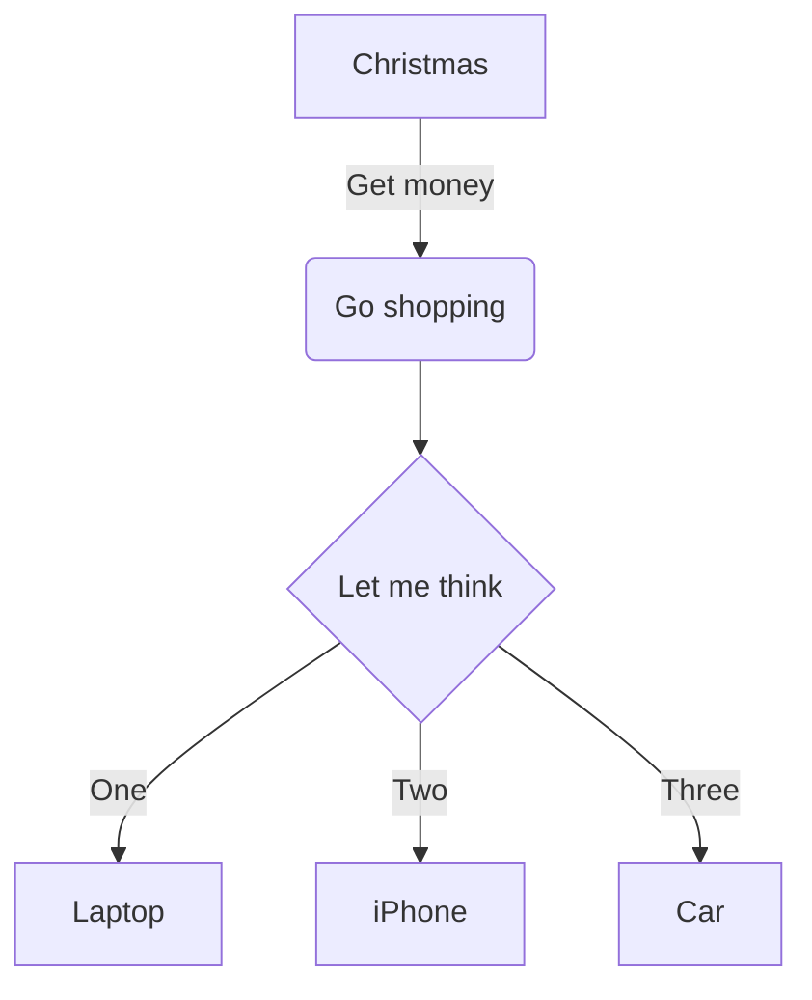
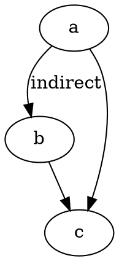
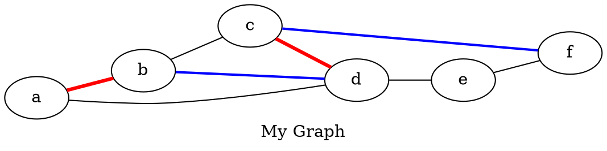

BooGi gives you powerful diagramming capabilities, allowing you to treat
your graphs / diagrams as a code. To give such possibility, BooGi offers
two diagramming "languages": [Mermaid](#mermaiddiagrams) and [Graphviz](#graphvizgraphs).
Both process Mermaid process markdown code blocks to generate graphs during
page build time.

## Mermaid diagrams

Mermaid can be used to create UML and non-UML diagrams, such as:
* [flowcharts](https://mermaid-js.github.io/mermaid/#/flowchart)
* [sequence diagrams](https://mermaid-js.github.io/mermaid/#/sequenceDiagram)
* [class diagrams](https://mermaid-js.github.io/mermaid/#/classDiagram)
* [state diagrams](https://mermaid-js.github.io/mermaid/#/stateDiagram)
* [entity relationship diagrams (ERD)](https://mermaid-js.github.io/mermaid/#/entityRelationshipDiagram)
* [user journey maps](https://mermaid-js.github.io/mermaid/#/user-journey)
* [gantt diagrams](https://mermaid-js.github.io/mermaid/#/gantt)
* [pie charts](https://mermaid-js.github.io/mermaid/#/pie)

Mermaid offers a way to create even complex diagrams. To create a diagram,
define code block with language `mermaid` and use [Mermaid syntax](https://mermaid-js.github.io/mermaid/#/).

<Info>

To learn Mermaid syntax visit [this guide](https://mermaid-js.github.io/mermaid/#/) (go to
_Diagrams_ section to find syntax you're looking for).
</Info>

Mermaid diagrams can be additionally configured in BooGi page config,
as described in [features reference](/configuration/setting-up/features#mermaidgraphs).

**Example:**

~~~markdown

~~~


## Graphviz graphs

Graphviz offers graph visualization for representing structural information as
diagrams of abstract graphs and networks. It has important applications in networking,
bioinformatics, software engineering, database and web design, machine learning,
and in visual interfaces for other technical domains. It uses
DOT language to define graphs.

Currently Graphviz offers `dot` and `circo` layouts:  

* `dot` makes “hierarchical” or layered drawings of directed graphs. The layout
algorithm aims edges in the same direction (top to bottom, or left to right)
and then attempts to avoid edge crossings and reduce edge length.

* `circo` is a circular layout. This is suitable for certain diagrams of multiple
cyclic structures, such as certain telecommunications networks.

To create a graph, define code block with language `dot` (for dot diagrams)
or `circo` (for circo diagrams). 

Follow [DOT syntax guide](https://graphviz.org/doc/info/lang.html) to learn how
to create diagrams.
Check examples provided [here](https://renenyffenegger.ch/notes/tools/Graphviz/examples/index).


**Examples**

<Layout>

<div>

**`dot` diagram**
~~~

~~~


</div>

<div>

**`circo` diagram**
~~~
```circo
digraph graphname {
  a -> b [ label = "indirect"];
  b -> c;
  a -> c;
}
```
~~~

```circo
digraph graphname {
  a -> b [ label = "indirect"];
  b -> c;
  a -> c;
}
```

</div>

</Layout>

**Complex `circo` diagram**

<Layout>

~~~markdown
```circo
digraph g1 {
    node [shape = doublecircle]; N4 N6;
    node [shape = circle];
    N0 -> N1 [ label = "{1,0}"];
    N1 -> N2 [ label = "{1,0}"];
    N2 -> N3 [ label = "{1,0}"];
    N3 -> N4 [ label = "{1,0}"];
    N4 -> N5 [ label = "{1,0}"];
    N5 -> N6 [ label = "{1,0}"];
    N6 -> N0 [ label = "{1,0}"];

    N0 -> N4 [ label = "{1,0}"];
    N1 -> N5 [ label = "{1,0}"];
    N2 -> N6 [ label = "{1,0}"];
    N3 -> N0 [ label = "{1,0}"];
    N4 -> N1 [ label = "{1,0}"];
    N5 -> N2 [ label = "{1,0}"];
    N6 -> N3 [ label = "{1,0}"];    
}
```
~~~

```circo
digraph g1 {
    node [shape = doublecircle]; N4 N6;
    node [shape = circle];
    N0 -> N1 [ label = "{1,0}"];
    N1 -> N2 [ label = "{1,0}"];
    N2 -> N3 [ label = "{1,0}"];
    N3 -> N4 [ label = "{1,0}"];
    N4 -> N5 [ label = "{1,0}"];
    N5 -> N6 [ label = "{1,0}"];
    N6 -> N0 [ label = "{1,0}"];

    N0 -> N4 [ label = "{1,0}"];
    N1 -> N5 [ label = "{1,0}"];
    N2 -> N6 [ label = "{1,0}"];
    N3 -> N0 [ label = "{1,0}"];
    N4 -> N1 [ label = "{1,0}"];
    N5 -> N2 [ label = "{1,0}"];
    N6 -> N3 [ label = "{1,0}"];    
}
```

</Layout>

**Complex `dot` diagram**

<Layout>

~~~markdown

~~~


</Layout>