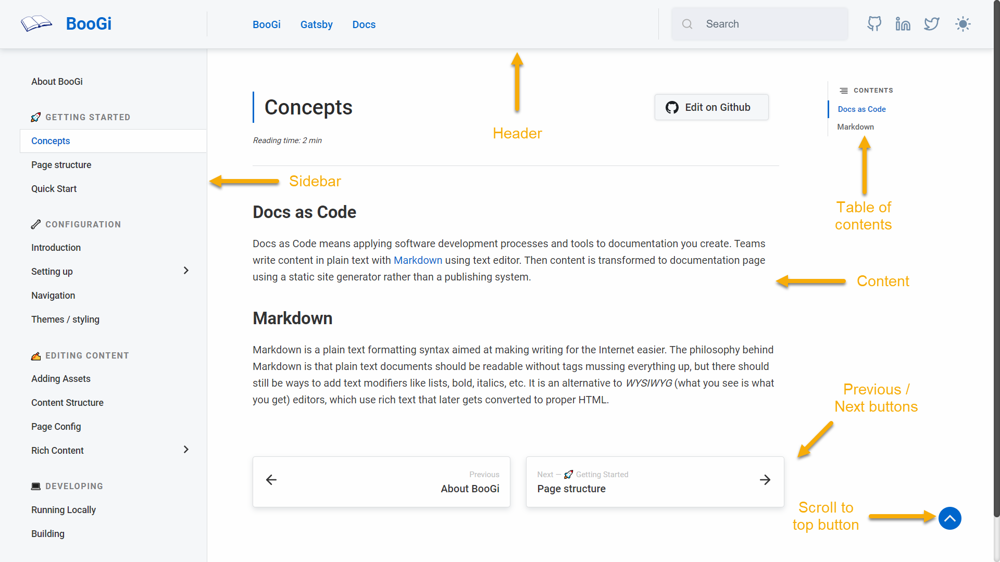
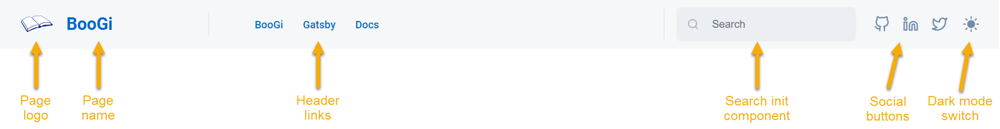
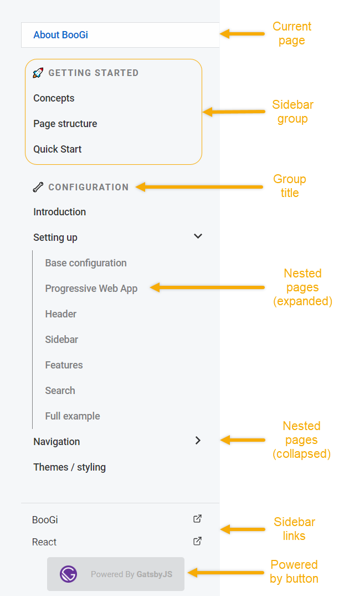
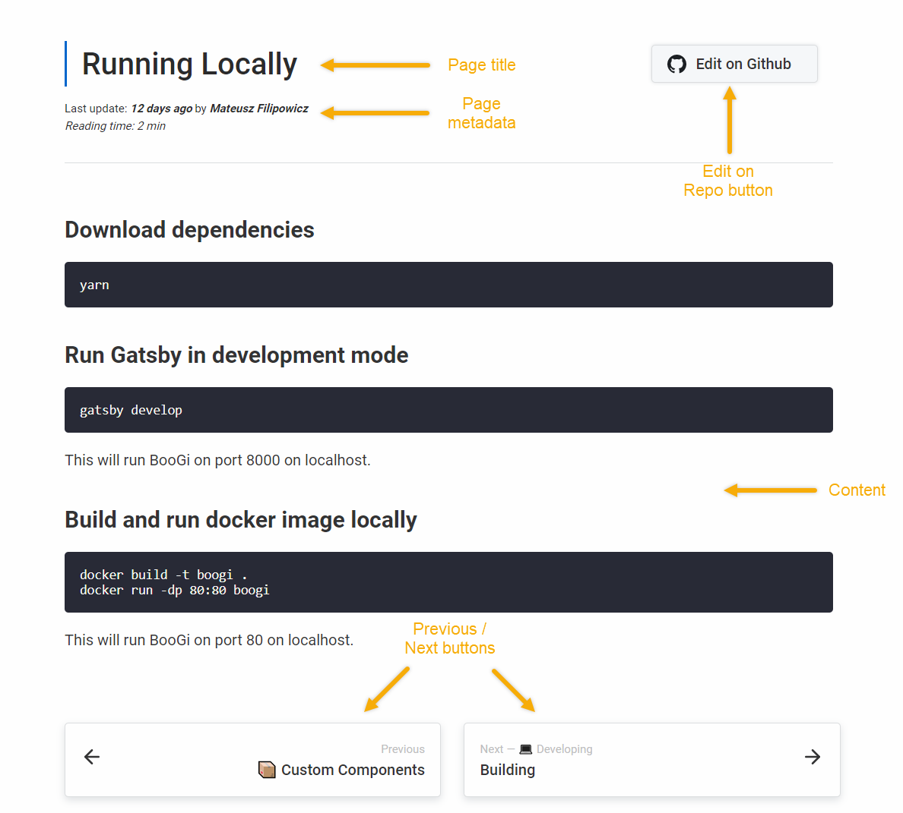

Check BooGi page layout and how different components relate to each other 
and where they are placed.

### General page structure

---

### Header

---

### Navigation sidebar

---

### Page content

---

### Search sidebar

---