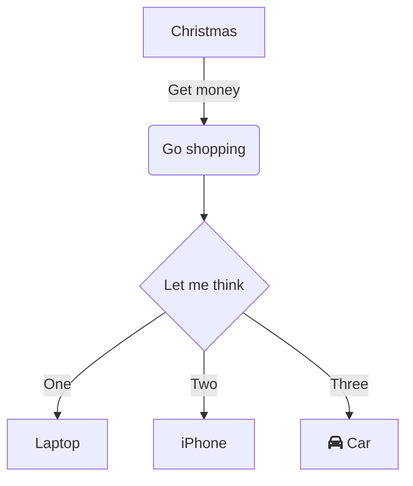

Custom components are extensions to Markdown. To use them, use proper
HTML tag with configuration (if applicable).

## Layout

Layout can be used to implement multi-column layout. Columns always equally
share space. Within columns you can use standard Markdown syntax or include
custom components.

**Syntax**

Simple:

```html
<Layout>

*Lorem ipsum* dolor **sit amet**, consectetur adipiscing elit. Aenean lobortis turpis 
luctus mi imperdiet lobortis vitae at urna. Sed posuere lacinia turpis a commodo.

*Lorem ipsum* dolor **sit amet**, consectetur adipiscing elit. Aenean lobortis turpis 
luctus mi imperdiet lobortis vitae at urna. Sed posuere lacinia turpis a commodo.

</Layout>
```

Complex:

```html
<Layout>

<div>


Here comes some **text**. And some [URL](https://google.com)

</div>

<div>

<Tip>Layout is nice!</Tip>

*Lorem ipsum* dolor **sit amet**, consectetur adipiscing elit. Aenean lobortis turpis 
luctus mi imperdiet lobortis vitae at urna. Sed posuere lacinia turpis a commodo.

</div>
</Layout>
```

**Examples**

**Example 1 -- single paragraphs**

<Layout>

*Lorem ipsum* dolor **sit amet**, consectetur adipiscing elit. Aenean lobortis turpis 
luctus mi imperdiet lobortis vitae at urna. Sed posuere lacinia turpis a commodo.

*Lorem ipsum* dolor **sit amet**, consectetur adipiscing elit. Aenean lobortis turpis 
luctus mi imperdiet lobortis vitae at urna. Sed posuere lacinia turpis a commodo.

</Layout>

**Example 2 -- complex paragraphs**

<Layout>

<div>


Here comes some **text**. And some [URL](https://google.com)

</div>

<div>

<Tip>Layout is nice!</Tip>

*Lorem ipsum* dolor **sit amet**, consectetur adipiscing elit. Aenean lobortis turpis 
luctus mi imperdiet lobortis vitae at urna. Sed posuere lacinia turpis a commodo.

</div>
</Layout>

## Highlights

Highlights can be used to distinguish some part of text.

**Syntax**

```html
<Note>

Some **note** text</Note>
<Tip>

Some _tip_ text
</Tip>
<Info>Some **error** text</Info>
<Warning>Some _warning/error_ text</Warning>
```

**Important!** There must be newline between highlight tag
and it's content to render inline markdown properly. Without
newline content will be displayed as written, without any markdown rendering.

**Examples**

<Note>

Some **note** text
</Note>
<Tip>

Some _tip_ text
</Tip>
<Info>Some **info** text</Info>
<Warning>Some _warning/error_ text</Warning>

## Badges

**Syntax**

```html
<Badge>Default Badge</Badge>
<Badge color="#fe9612">Orange Badge</Badge>

You can also use badge <Badge color="red">Inline Badge</Badge> 
inline your text.
```

**Examples**

<Badge>Default Badge</Badge>
<Badge color="#fe9612">Orange Badge</Badge>

You can also use badge <Badge color="red">Inline Badge</Badge> 
inline your text.

## Icons

It is possible to use Icons provided by `react-feather`.
Reference and available icons can be found [here](https://bit.dev/feathericons/react-feather);

**Syntax**

`<Icon name="<name>" color="[color]"/>`
* `name` - mandatory, it is `feather` icon name
* `color` - color to be used

```html
<Icon name="Calendar"/>
<Icon name="Calendar" color="#fe9612"/>
<Icon name="Calendar" color="#ff0000"/>
<Icon name="calendar" color="brown"/>
<Icon name="calendar" color="green"/>

If can use kebab-case <Icon name="phone-call" color="#3487e1"/> 
or PascalCase (UpperCamelCase) <Icon name="PhoneCall" color="#34e187"/> for icon name.
```

**Examples**

<Icon name="Calendar"/>
<Icon name="Calendar" color="#fe9612"/>
<Icon name="Calendar" color="#ff0000"/>
<Icon name="calendar" color="brown"/>
<Icon name="calendar" color="green"/>

If can use kebab case <Icon name="phone-call" color="#3487e1"/> 
or camel case <Icon name="PhoneCall" color="#34e187"/>syntax.

## Jargon / Definitions

Gatsby uses `remark-jargon` plugin to inline definitions of 
popular jargon used. This is a good way to define abbreviations
used in your company / area / profession.

First define your jargon / definitions in `jargon.json` in main
directory.

**Syntax**

`jargon.json`
```json
{
  "msf": {
    "name": "MSF",
    "long_name": "Médecins Sans Frontières / Doctors Without Borders",
    "description": "An international, independent, medical humanitarian organisation."
  }
}
```

Then in markdown wrap word defined as key above in `_` to use Jargon. 
```markdown
Organization _MSF_ is helping society a lot.
```  

**Example**

Organization _MSF_ is helping society a lot.

## Emoticons

## Diagrams



## Diff

The following is a code block with diff. 
Lines with `+` highlighted in green shade indicating an addition. 
Lines with `-` highlighted in red shade indicating a deletion.

```javascript
- const data = ['1','2'];
+ const data = [1,2];
```

## Embed external code snippets

`embed:hello-js.js#L1`

`embed:hello.java`

## Live Editing

**Syntax**

```
```javascript react-live=true
<button className={'btn btn-default'}>Change my text</button>
`` `
```

**Example**

```javascript react-live=true
<button className={'btn btn-default'}>Change my text</button>
```
